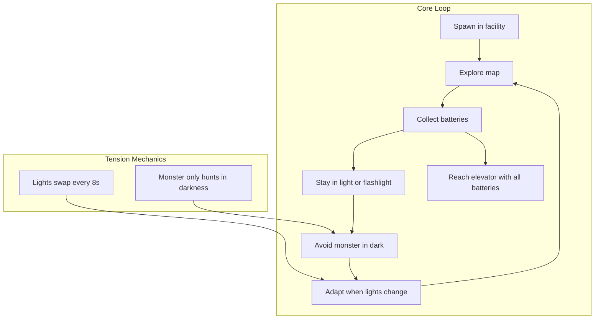

# Luzes Apagadas — Detailed Task Plan

## Gameplay Loop (Target Experience)

---

## Phase 1: Implementation Plan Fixes (Prerequisites)

### Task 1.1: Fix Wall Flickering

**File:** [src/graphics/drawlevel.cpp](d:\UNIFAP\projeto-doom-computacao-grafica\src\graphics\drawlevel.cpp)

**Location:** `drawFace()` function (approx. lines 376-395)

**Change:** Replace the narrow `outside` check with a broad one:

- **Current:** `bool outside = (neighbor == '0' || neighbor == 'B' || neighbor == 'D');`
- **Target:** `bool outside = (neighbor != '1' && neighbor != '2' && neighbor != '3');`

**Verification:** Walk near entity tiles (`P`, `H`, `9`, `J`, etc.) and indoor/outdoor transitions. Walls must render without flicker.

---

### Task 1.2: Enemy AI — Safe Zone Boundary Avoidance

**File:** [src/core/entities.cpp](d:\UNIFAP\projeto-doom-computacao-grafica\src\core\entities.cpp)

**Changes:**

1. **Remove** the early-return that freezes enemies inside safe zones (lines 55-66). Enemies should never be allowed to enter safe zones in the first place.
2. **Modify CHASE movement** (lines 88-99): Before applying `en.x = nextX` or `en.z = nextZ`, check if the new position would be inside a safe zone:
  - If `isPositionInSafeZone(lvl.posts, nextX, en.z, GameConfig::SAFE_ZONE_RADIUS)` → do not update `en.x`
  - If `isPositionInSafeZone(lvl.posts, en.x, nextZ, GameConfig::SAFE_ZONE_RADIUS)` → do not update `en.z`
3. **Handle already-inside edge case:** If an enemy is inside a safe zone at spawn or after a post turns on, set `en.state = STATE_IDLE` and do not move/attack until they are outside (e.g., when the post turns off).

**Verification:** Enemies chase toward the player but stop at the edge of active light cones. They do not step into the safe zone.

---

### Task 1.3: Ceiling Texture

**File:** [src/graphics/drawlevel.cpp](d:\UNIFAP\projeto-doom-computacao-grafica\src\graphics\drawlevel.cpp)

**Changes:**

1. Add `GLuint texTeto` parameter to `desenhaQuadTeto()` (line ~148).
2. Bind `texTeto` instead of `glBindTexture(GL_TEXTURE_2D, 0)`.
3. Add UV coordinates to the ceiling quad (e.g., 0–1 across the quad).
4. Remove or neutralize `glColor3f(0,0,0)` so the texture is visible.
5. Thread `r.texTeto` through `desenhaTileChao()` and `desenhaTileSangue()` and pass it to all `desenhaQuadTeto()` calls.

**Verification:** Ceiling shows [assets/082.png](d:\UNIFAP\projeto-doom-computacao-grafica\assets\082.png) texture instead of solid black.

---

## Phase 2: Luzes Apagadas Core Mechanics

### Task 2.1: Add Battery Collectible and ItemType

**Files:** [include/core/entities.h](d:\UNIFAP\projeto-doom-computacao-grafica\include\core\entities.h), [src/level/level.cpp](d:\UNIFAP\projeto-doom-computacao-grafica\src\level\level.cpp)

**Changes:**

1. In `entities.h`: Add `ITEM_BATTERY` to `ItemType` enum.
2. In `level.cpp`: Add handling for tile `'B'` (or a new char like `'V'` if `B` is blood) as battery spawn:
  - Create `Item` with `type = ITEM_BATTERY`, `active = true`, `respawnTimer = 0` (no respawn).

**Map convention:** Use a new character, e.g. `'V'` (bateria / volt) to avoid conflict with blood `'B'`. Update map loader if `B` is already used.

---

### Task 2.2: Track Battery Count in Game State

**Files:** [include/core/game_state.h](d:\UNIFAP\projeto-doom-computacao-grafica\include\core\game_state.h), [src/core/entities.cpp](d:\UNIFAP\projeto-doom-computacao-grafica\src\core\entities.cpp), [src/core/game.cpp](d:\UNIFAP\projeto-doom-computacao-grafica\src\core\game.cpp)

**Changes:**

1. In `PlayerState`: Add `int batteriesCollected = 0` and a constant `BATTERIES_REQUIRED = 14` (or tunable value).
2. In `entities.cpp` item pickup loop: For `ITEM_BATTERY`, increment `g.player.batteriesCollected`, set `item.respawnTimer = 999999.0f` (no respawn).
3. In `game.cpp` `gameReset()`: Reset `g.player.batteriesCollected = 0`.

---

### Task 2.3: Gate Elevator/Exit on Battery Count

**File:** [src/core/game.cpp](d:\UNIFAP\projeto-doom-computacao-grafica\src\core\game.cpp)

**Location:** Door exit check block (lines 259-287).

**Changes:**

1. Only allow victory/level transition when the player is within door range **and** `g.player.batteriesCollected >= BATTERIES_REQUIRED`.
2. If batteries are insufficient: optionally show feedback (e.g., door does not open, or brief message). Consider storing `BATTERIES_REQUIRED` in `GameConfig` or `PlayerState` for tuning.

**Design note:** For multi-level flow, decide if batteries carry across levels or are per-level. Roblox uses 14 total; you may split e.g. 5+5+4 across levels 1–3.

---

### Task 2.4: Monster Only Hunts in Darkness

**File:** [src/core/entities.cpp](d:\UNIFAP\projeto-doom-computacao-grafica\src\core\entities.cpp)

**Concept:** The monster can only see and attack the player when the player is in darkness (not in a safe zone and flashlight off).

**Changes:**

1. Before entering `STATE_CHASE` from `STATE_IDLE`: Check `playerIsInSafeZone(...) || g.flashlightOn`. If the player is safe, do not transition to CHASE.
2. In `STATE_CHASE`: If the player enters a safe zone or turns on flashlight, transition back to `STATE_IDLE`.
3. In `STATE_ATTACK`: Same rule — if the player becomes "visible" (in light), transition to `STATE_IDLE` or `STATE_CHASE` and do not apply attack damage this frame.

**Dependency:** Requires `playerIsInSafeZone()` and `g.flashlightOn` to be accessible from `updateEntities()` (they already are via `gameContext()` and `gameLevel()`).

---

### Task 2.6: HUD Battery Count Display

**Files:** [include/graphics/hud.h](d:\UNIFAP\projeto-doom-computacao-grafica\include\graphics\hud.h), [src/graphics/hud.cpp](d:\UNIFAP\projeto-doom-computacao-grafica\src\graphics\hud.cpp)

**Changes:**

1. Add `batteriesCollected` and `batteriesRequired` to `HudState`.
2. In `gameRender()`, pass `g.player.batteriesCollected` and `BATTERIES_REQUIRED` into `HudState`.
3. Render a small indicator (e.g. "Baterias: 3/14" or icon count) in a corner of the HUD. Use existing `ui_text` or a simple quad+texture.

---

### Task 2.7: Battery Texture and Draw Logic

**Files:** [include/utils/assets.h](d:\UNIFAP\projeto-doom-computacao-grafica\include\utils\assets.h), [src/utils/assets.cpp](d:\UNIFAP\projeto-doom-computacao-grafica\src\utils\assets.cpp), [src/graphics/drawlevel.cpp](d:\UNIFAP\projeto-doom-computacao-grafica\src\graphics\drawlevel.cpp) (or wherever items are drawn)

**Changes:**

1. Load a battery texture (create or reuse an asset, e.g. `texBattery`).
2. Add `texBattery` to `RenderAssets` and `GameAssets`.
3. In item draw logic (`drawEntities` or equivalent): For `ITEM_BATTERY`, render a billboard/quad with the battery texture when `item.active` is true.

---

## Phase 3: Level Design and Light Timing

### Task 3.1: Place Battery Spawns in Maps

**Files:** [maps/level1.txt](d:\UNIFAP\projeto-doom-computacao-grafica\maps\level1.txt), [maps/level2.txt](d:\UNIFAP\projeto-doom-computacao-grafica\maps\level2.txt), [maps/level3.txt](d:\UNIFAP\projeto-doom-computacao-grafica\maps\level3.txt)

**Note:** `'B'` is blood in the map format. Use a new character such as `'V'` for batteries.

**Changes:**

1. Add battery tiles (`V`) across levels so total count equals `BATTERIES_REQUIRED` (e.g. 5 in level 1, 5 in level 2, 4 in level 3).
2. Place batteries in a mix of safe and risky spots: some near light posts, some in corridors that go dark when lights swap, to encourage planning and tension.

---

### Task 3.2: Tune Light Cycle for Pacing

**File:** [include/core/light_system.h](d:\UNIFAP\projeto-doom-computacao-grafica\include\core\light_system.h)

**Current:** `durationON = 6.0f`, `durationFLICKER = 2.0f`. Roblox uses ~30 s for a full change.

**Changes:**

1. Consider increasing `durationON` to 8–12 s for more breathing room, or keep 6 s for higher tension.
2. Ensure `durationFLICKER` (2 s) gives a clear warning before lights swap.
3. Add a config constant (e.g. in `GameConfig`) for `LIGHT_CYCLE_ON_SECONDS` so designers can tune without editing `LightSystem` defaults.

---

## Phase 4: Audio and Feedback

### Task 4.1: Battery Pickup Sound

**Files:** [include/audio/audio_system.h](d:\UNIFAP\projeto-doom-computacao-grafica\include\audio\audio_system.h), [src/audio/audio_system.cpp](d:\UNIFAP\projeto-doom-computacao-grafica\src\audio\audio_system.cpp)

**Changes:**

1. Add `audioPlayBatteryPickup(AudioSystem&)` or reuse an existing "item pickup" sound.
2. Call it from `entities.cpp` when `ITEM_BATTERY` is collected.

---

### Task 4.2: Door Locked / Insufficient Batteries Feedback

**Files:** [src/core/game.cpp](d:\UNIFAP\projeto-doom-computacao-grafica\src\core\game.cpp), [include/audio/audio_system.h](d:\UNIFAP\projeto-doom-computacao-grafica\include\audio\audio_system.h)

**Changes:**

1. When the player is near the door but `batteriesCollected < BATTERIES_REQUIRED`: play a "locked" or "denied" sound once (debounce to avoid spam).
2. Optional: brief on-screen text "Preciso de mais baterias" when attempting to use the elevator.

---

### Task 4.3: Darkness Creep Audio Cue

**Files:** [src/audio/audio_system.cpp](d:\UNIFAP\projeto-doom-computacao-grafica\src\audio\audio_system.cpp), [src/core/game.cpp](d:\UNIFAP\projeto-doom-computacao-grafica\src\core\game.cpp)

**Concept:** Subtle ambience when the player is in darkness (no safe zone, flashlight off) to increase tension.

**Changes:**

1. Add a low-volume loop or one-shot that plays when the player has been in darkness for > 1 s.
2. Stop or fade when the player enters light or turns on the flashlight.

---

## Phase 5: Gameplay Loop Polish

### Task 5.1: Tutorial or On-Screen Hints

**File:** [src/graphics/hud.cpp](d:\UNIFAP\projeto-doom-computacao-grafica\src\graphics\hud.cpp) or menu system

**Changes:**

1. On first spawn or first few seconds: Show brief hints such as "Fique na luz ou use a lanterna. O monstro só ataca no escuro." and "Colete todas as baterias para ativar o elevador."
2. Use a timer to hide hints after 5–10 s, or on first movement.

---

### Task 5.2: Victory Message Customization

**File:** [src/core/game.cpp](d:\UNIFAP\projeto-doom-computacao-grafica\src\core\game.cpp), [src/graphics/menu.cpp](d:\UNIFAP\projeto-doom-computacao-grafica\src\graphics\menu.cpp)

**Changes:**

1. Update victory screen text to something like "VOCE ESCAPOU!" or "LUZES APAGADAS — VITORIA" to reinforce the theme.

---

### Task 5.3: Difficulty Tuning Constants

**File:** [include/core/config.h](d:\UNIFAP\projeto-doom-computacao-grafica\include\core\config.h)

**Add tunable constants:**

- `BATTERIES_REQUIRED`
- `LIGHT_CYCLE_ON_SECONDS`, `LIGHT_CYCLE_FLICKER_SECONDS`
- Optionally: `ENEMY_SPEED`, `ENEMY_VIEW_DIST` for difficulty presets

---

## Implementation Order

| Order | Task                               | Dependencies |
| ----- | ---------------------------------- | ------------ |
| 1     | 1.1 Wall Flickering                | None         |
| 2     | 1.2 Enemy Safe Zone Avoidance      | None         |
| 3     | 1.3 Ceiling Texture                | None         |
| 4     | 2.1 Battery ItemType + map char    | None         |
| 5     | 2.2 Battery count in PlayerState   | 2.1          |
| 6     | 2.4 Monster Hunts in Darkness Only | 1.2          |
| 7     | 2.3 Gate Exit on Batteries         | 2.2          |
| 8     | 2.6 HUD Battery Display            | 2.2          |
| 9     | 2.7 Battery Texture + Draw         | 2.1          |
| 10    | 3.1 Place Batteries in Maps        | 2.1          |
| 11    | 3.2 Tune Light Cycle               | None         |
| 12    | 4.1 Battery Pickup Sound           | 2.2          |
| 13    | 4.2 Door Locked Feedback           | 2.3          |
| 14    | 4.3 Darkness Ambience              | None         |
| 15    | 5.1–5.3 Polish                     | All above    |

---

## Key Files Reference

| System        | Primary Files                                                                                                                                                                                          |
| ------------- | ------------------------------------------------------------------------------------------------------------------------------------------------------------------------------------------------------ |
| Entities / AI | [src/core/entities.cpp](d:\UNIFAP\projeto-doom-computacao-grafica\src\core\entities.cpp), [include/core/entities.h](d:\UNIFAP\projeto-doom-computacao-grafica\include\core\entities.h)                 |
| Lighting      | [src/core/light_system.cpp](d:\UNIFAP\projeto-doom-computacao-grafica\src\core\light_system.cpp), [include/core/light_system.h](d:\UNIFAP\projeto-doom-computacao-grafica\include\core\light_system.h) |
| Game Loop     | [src/core/game.cpp](d:\UNIFAP\projeto-doom-computacao-grafica\src\core\game.cpp)                                                                                                                       |
| Level Loading | [src/level/level.cpp](d:\UNIFAP\projeto-doom-computacao-grafica\src\level\level.cpp), [include/level/level.h](d:\UNIFAP\projeto-doom-computacao-grafica\include\level\level.h)                         |
| Rendering     | [src/graphics/drawlevel.cpp](d:\UNIFAP\projeto-doom-computacao-grafica\src\graphics\drawlevel.cpp), [src/graphics/hud.cpp](d:\UNIFAP\projeto-doom-computacao-grafica\src\graphics\hud.cpp)             |
| Config        | [include/core/config.h](d:\UNIFAP\projeto-doom-computacao-grafica\include\core\config.h)                                                                                                               |

